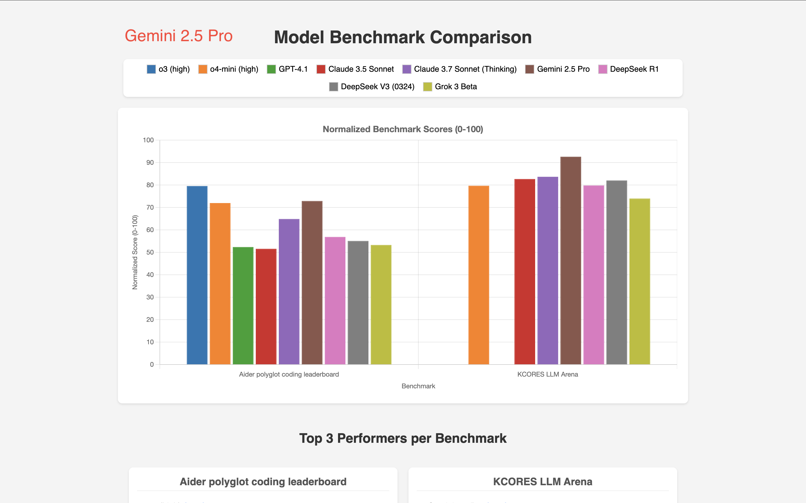

# Model Benchmark Viz

A project to evaluate different models on their ability to generate visualizations of model benchmarks for coding.

## Results

### 🥇 GPT-4.1

GPT-4.1 generated the best looking visualization, with clear labels on the bar chart and legend:

Source code: [gpt-4.1.html](output/gpt-4.1.html)

### 🥈 o3

o3 generated the second best visualization, with clear labels on the bar chart:

Source code: [o3.html](output/o3.html)

### 🥉 Claude 3.7

Claude 3.7 generated the third best visualization.

It uses scatter plots to compare the results of the models which is a big plus. However it has some formatting issues so the output doesn't look as good as the other visualizations:

Source code: [claude-3.7.html](output/claude-3.7.html)

I also ran Claude 3.7 again with the same prompt, but it produced a bar chart visualization:

Source code: [claude-3.7-2.html](output/claude-3.7-2.html)

### 4th place: Gemini 2.5 Pro and DeepSeek V3

Gemini 2.5 Pro, despite being ranked as the top model, produced a visualization that is not as good as the other models, with no labels on the bar chart.

Source code: [gemini-2.5-pro.html](output/gemini-2.5-pro.html)

Re-running the prompt again with Gemini 2.5 Pro did not produce a better visualization.

DeepSeek V3 generated a similar visualization to Gemini 2.5 Pro.

Source code: [deepseek-v3.html](output/deepseek-v3.html)

## Evaluation Results

Evaluations are carried out using [16x Eval](https://eval.16x.engineer/). Here is the screenshot:

## Prompt

The prompt used to generate the visualization is [PROMPT.md](PROMPT.md).

## Benchmark Data

The data is stored in `results.js`.

Benchmark Data Sources:

- [Aider polyglot coding leaderboard](https://aider.chat/docs/leaderboards/)
- [KCORES LLM Arena](https://github.com/KCORES/kcores-llm-arena)

## Model Inclusion Criteria

To avoid too much clutter, we employ the following criteria for model inclusion:

- The model must not be superceded by a newer model, where "newer" is defined as a model released by the same company with strictly higher performance and similar cost.
  - For example, o3-mini is superceded by o4-mini by OpenAI, hence it is not included.
