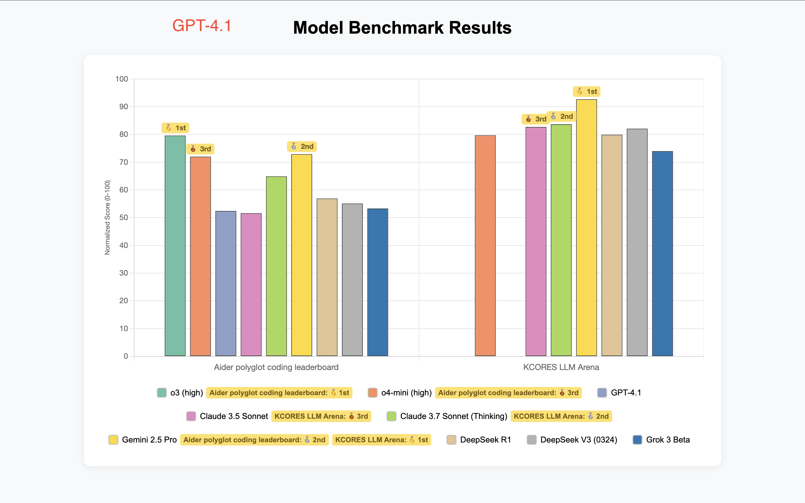
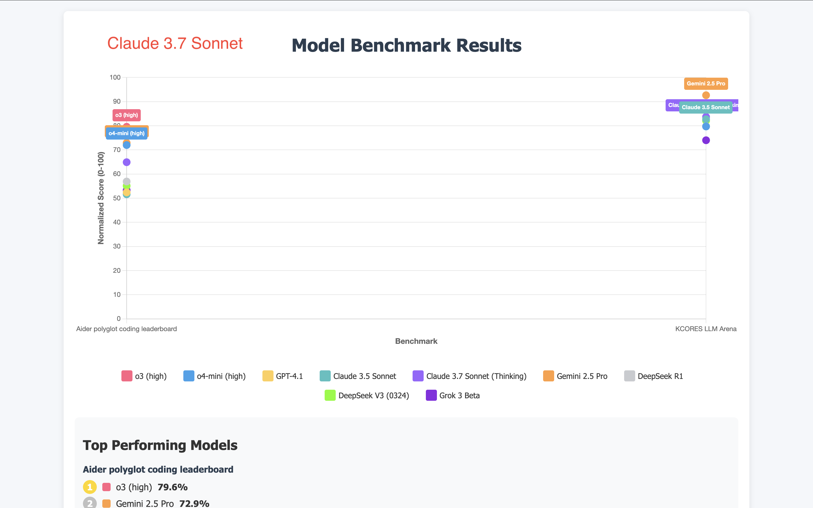
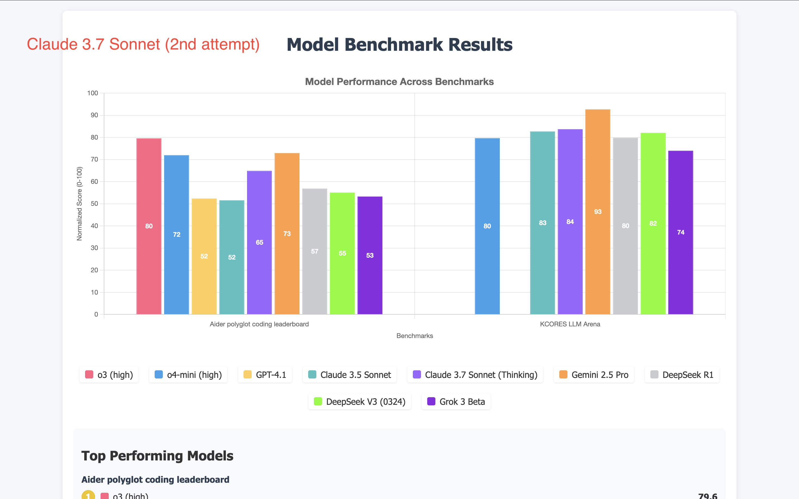
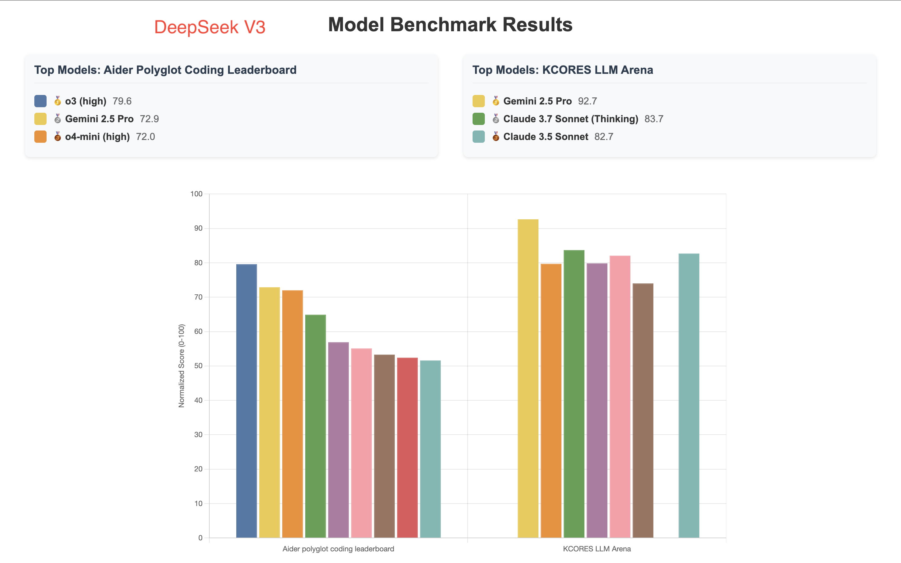
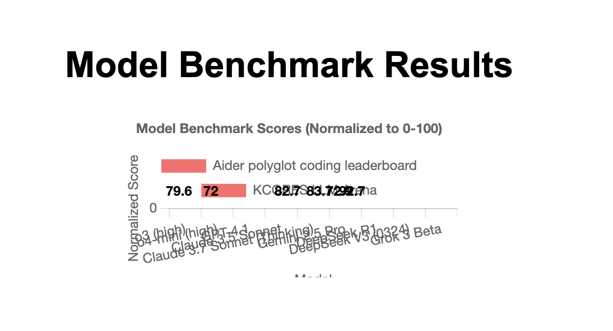
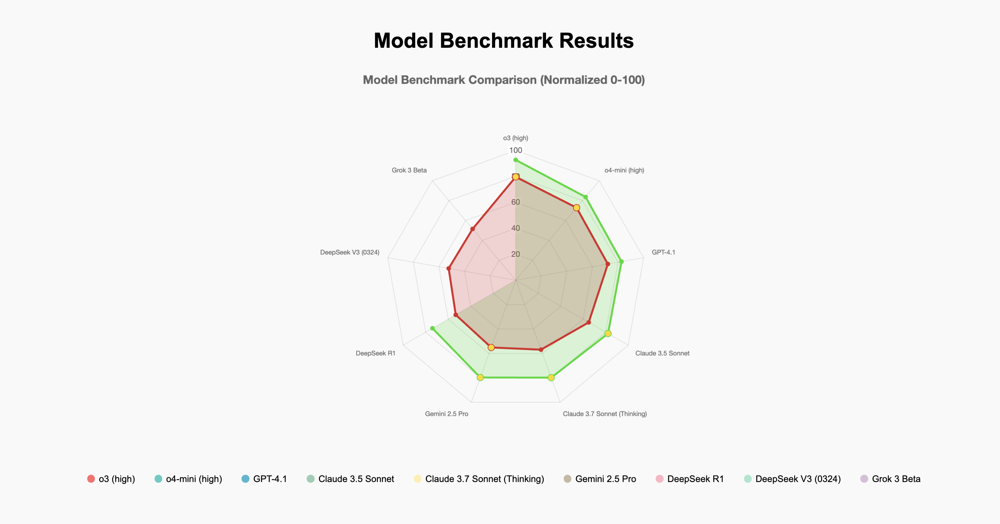
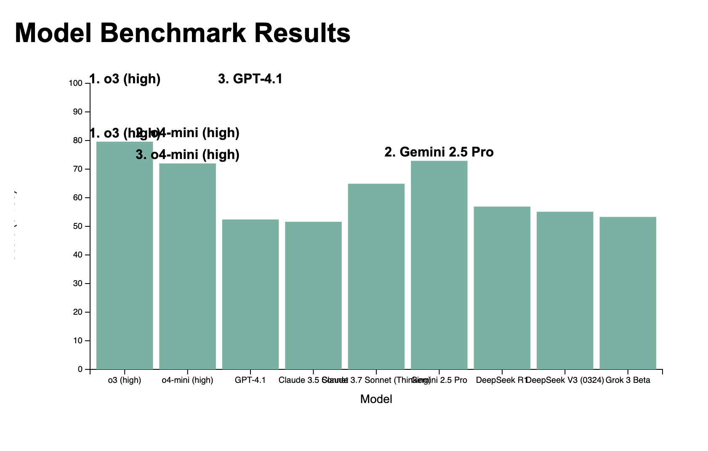
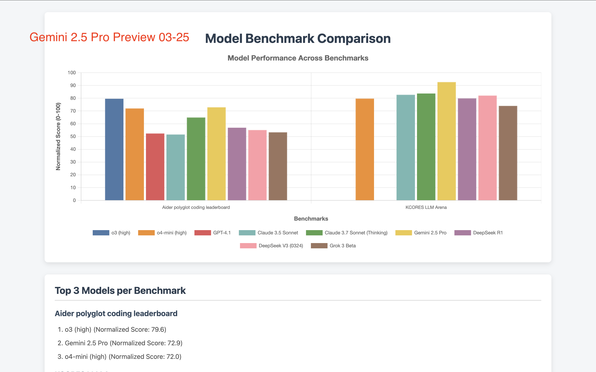
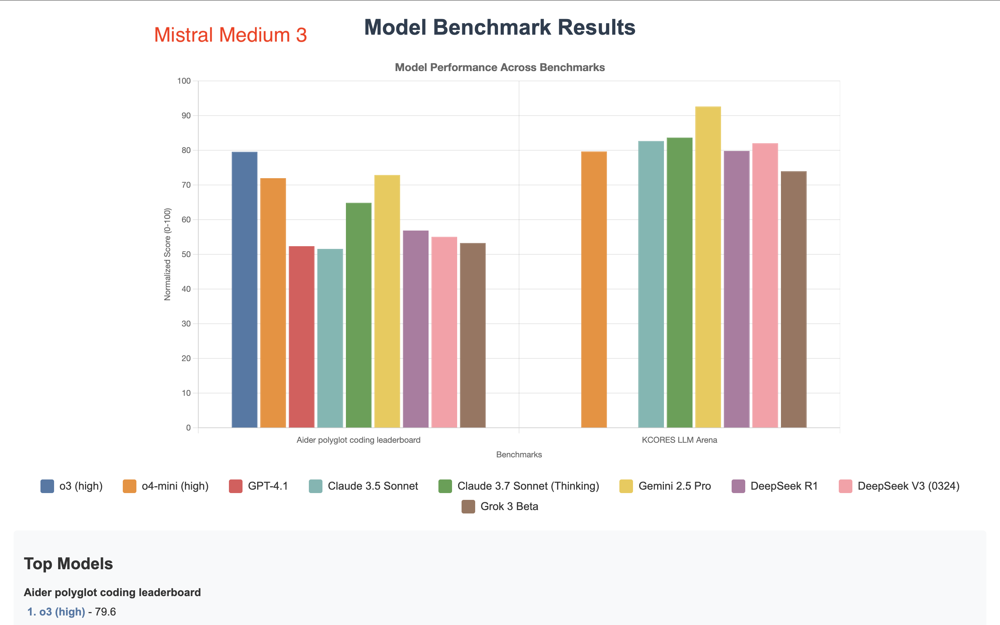
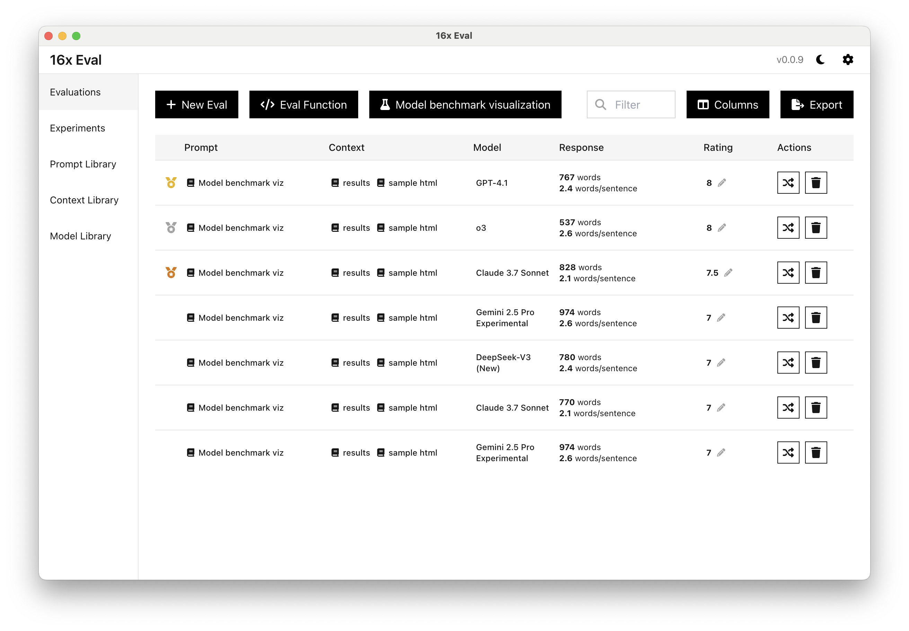

# Model Benchmark Viz

A project by [16x Eval](https://eval.16x.engineer/) to evaluate different models on their ability to generate visualizations of model benchmarks for coding.

## Results

### 🥇 GPT-4.1

GPT-4.1 generated the best looking visualization, with clear labels on the bar chart and legend:

Source code: [gpt-4.1.html](output/gpt-4.1.html)

### 🥈 o3

o3 generated the second best visualization, with clear labels on the bar chart:

Source code: [o3.html](output/o3.html)

### 🥉 Claude 3.7

Claude 3.7 generated the third best visualization.

It uses scatter plots to compare the results of the models which is a big plus. However it has some formatting issues so the output doesn't look as good as the other visualizations:

Source code: [claude-3.7.html](output/claude-3.7.html)

I also ran Claude 3.7 again with the same prompt, but it produced a bar chart visualization:

Source code: [claude-3.7-2.html](output/claude-3.7-2.html)

### 4th place: Gemini 2.5 Pro Experimental and DeepSeek V3

Gemini 2.5 Pro Experimental, despite being ranked as the top model, produced a visualization that is not as good as the other models, with no labels on the bar chart.

Source code: [gemini-2.5-pro-exp.html](output/gemini-2.5-pro-exp.html)

Re-running the prompt again with Gemini 2.5 Pro Experimental did not produce a better visualization.

DeepSeek V3 generated a similar visualization to Gemini 2.5 Pro.

Source code: [deepseek-v3.html](output/deepseek-v3.html)

### Qwen3 235B A22B

Qwen3 235B A22B (thinking, via Parasail on OpenRouter) generated a visualization that is very small and hard to read.

Source code: [qwen3.html](output/qwen3.html)

I also tried the non-thinking version of Qwen3 (by adding `/no_think` to the end of the prompt, via Parasail on OpenRouter), it produced a nice radar chart visualization, which is interesting, but not suitable for the task of comparing the performance of the models:

Source code: [qwen3-no-think.html](output/qwen3-no-think.html)

### Mercury Coder Small

Mercury Coder Small generated a visualization that is buggy and not very readable.

It does not seem to show both benchmarks, and the labels are not very readable.

Source code: [mercury-coder-small.html](output/mercury-coder-small.html)

### Gemini 2.5 Pro Preview 03-25

Gemini 2.5 Pro Preview 03-25 generated a visualization that is very similar to the Gemini 2.5 Pro Experimental visualization.

Source code: [gemini-2.5-pro-preview-03-25.html](output/gemini-2.5-pro-preview-03-25.html)

### Gemini 2.5 Pro Preview 05-06

Gemini 2.5 Pro Preview 05-06 generated a visualization that is very similar to the Gemini 2.5 Pro Experimental visualization.

Source code: [gemini-2.5-pro-preview-05-06.html](output/gemini-2.5-pro-preview-05-06.html)

### Mistral Medium 3

Mistral Medium 3 generated a typical bar chart visualization.

Source code: [mistral-medium-3.html](output/mistral-medium-3.html)

## Evaluation Results

Evaluations are carried out using [16x Eval](https://eval.16x.engineer/). Here is the screenshot:

## Prompt

The prompt used to generate the visualization is [PROMPT.md](PROMPT.md).

Context used:

- [results.js](results.js)
- [sample-index.html](sample-index.html)

## Benchmark Data

The data is stored in `results.js`.

Benchmark Data Sources:

- [Aider polyglot coding leaderboard](https://aider.chat/docs/leaderboards/)
- [KCORES LLM Arena](https://github.com/KCORES/kcores-llm-arena)

## Model Inclusion Criteria

To avoid too much clutter, we employ the following criteria for model inclusion:

- The model must not be superceded by a newer model, where "newer" is defined as a model released by the same company with strictly higher performance and similar cost.
  - For example, o3-mini is superceded by o4-mini by OpenAI, hence it is not included.
