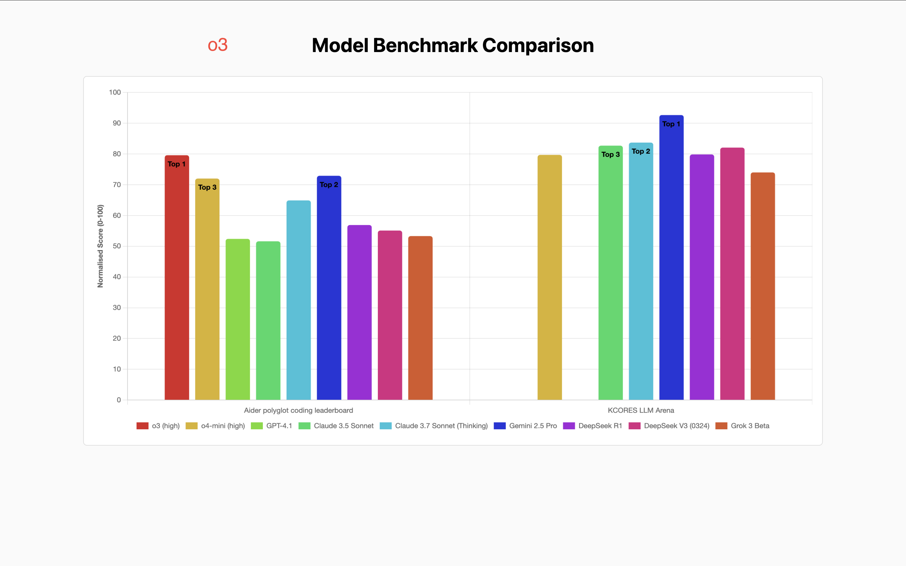
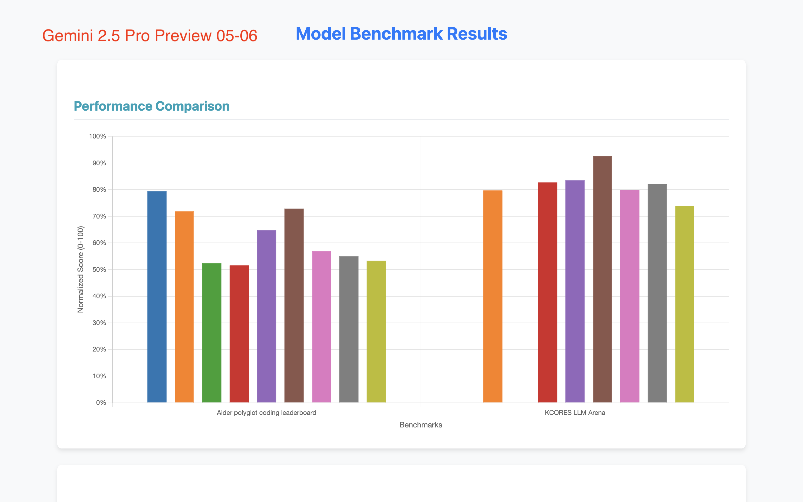

# Model Benchmark Viz

A project by [16x Eval](https://eval.16x.engineer/) to evaluate different models on their ability to generate visualizations of model benchmarks for coding.

For evaluation rubrics, check the [eval-data](https://github.com/paradite/eval-data) repo. [Direct link](https://github.com/paradite/eval-data/blob/main/projects/visualization/RUBRICS.md).

Rubrics is reproduced below for convenience:

```
Criteria:
- Side-by-side visualization without label: 8.5/10
- Baseline visualization without label: 8/10
- Horizontal bar chart (if cannot fit in the page): 7.5/10
- Has major formatting issues: 5/10
- Did not run / Code error: 1/10

Additional components:
- Side-by-side visualization
  - Color by benchmark: No effect on rating
  - Color by model: -0.5 rating
  - Alternative ways to differentiate benchmarks: +0.5 rating
- Clear labels on bar chart: +0.5 rating
- Poor color choice: -0.5 rating
- Minor formatting issues: -0.5 rating
```

## Results

### GPT-4.1

> Human rating: 8.5/10

GPT-4.1 generated a visualization with clear labels on the bar chart and legend:


Source code: [gpt-4.1.html](output/gpt-4.1.html)

### Claude Opus 4

> Human rating: 8.5/10

Claude 4 Opus generated a great looking visualization, with side-by-side comparison colored by benchmark and a legend. But it lacked labels on the bar chart:


Source code: [claude-opus-4.html](output/claude-opus-4.html)

### Claude Sonnet 4

> Human rating: 8.5/10

Claude Sonnet 4 generated a visualization that is very similar to Claude 4 Opus:


Source code: [claude-sonnet-4.html](output/claude-sonnet-4.html)

### Gemini 2.5 Pro (GA version)

> Human rating: 8.5/10

Gemini 2.5 Pro (GA version) generated a visualization that is great looking with clear labels on the bar chart.


### Kimi K2

> Human rating: 8.5/10

Kimi K2 generated a side-by-side visualization without labels on the bar chart.

Although the bars are colored by model instead of by benchmark, different benchmarks have different alpha intensity, which is a nice touch.


Source code: [kimi-k2-0711-preview.html](output/kimi-k2-0711-preview.html)

### o3

> Human rating: 8/10

o3 generated a visualization with clear labels on the bar chart. However, the colors were poorly chosen:



Source code: [o3.html](output/o3.html)

### Gemini 2.5 Pro Preview (06-05)

> Human rating: 8/10

The Gemini 2.5 Pro Preview [06-05] generated a visualization that is similar to o3, but with better labels on the bar chart. The colors were also pretty bad:


Source code: [gemini-2.5-pro-preview-06-05.html](output/gemini-2.5-pro-preview-06-05.html)

### Grok-4

> Human rating: 8/10

Grok-4 generated a visualization with side-by-side comparison of two benchmarks for each model, with clear labels on the ranking.

However, the colors were by model instead of by benchmark, which is not very helpful.


Source code: [grok-4.html](output/grok-4.html)

### Claude 3.7

> Human rating: 7.5/10

Claude 3.7 generated scatter plots to compare the results of the models which is a big plus. However it has some formatting issues so the output doesn't look as good as the other visualizations:


Source code: [claude-3.7.html](output/claude-3.7.html)

I also ran Claude 3.7 again with the same prompt, but it produced a bar chart visualization:


Source code: [claude-3.7-2.html](output/claude-3.7-2.html)

### Qwen3 Coder (via OpenRouter Alibaba Plus)

> Human rating: 7/10

Qwen3 Coder (via OpenRouter Alibaba Plus) generated a visualization with horizontal bars (which is cannot be fit in the page). The legends overlaps with the bar chart, causing minor formatting issues.

The first run generation was missing a chart, so we re-ran the prompt again.


Source code: [qwen3-coder-or-alibaba-plus.html](output/qwen3-coder-or-alibaba-plus-2.html)

### Gemini 2.5 Pro Experimental

> Human rating: 7/10

Gemini 2.5 Pro Experimental, despite being ranked as the top model, produced a visualization that is not as good as the other models, with no labels on the bar chart.


Source code: [gemini-2.5-pro-exp.html](output/gemini-2.5-pro-exp.html)

Re-running the prompt again with Gemini 2.5 Pro Experimental did not produce a better visualization.

### Gemini 2.5 Pro Preview 05-06

> Human rating: 7/10

Gemini 2.5 Pro Preview 05-06 generated a visualization that is very similar to the Gemini 2.5 Pro Experimental visualization.



Source code: [gemini-2.5-pro-preview-05-06.html](output/gemini-2.5-pro-preview-05-06.html)

### DeepSeek V3

> Human rating: 7/10

DeepSeek V3 generated a similar visualization to Gemini 2.5 Pro.


Source code: [deepseek-v3.html](output/deepseek-v3.html)

Source code: [mercury-coder-small.html](output/mercury-coder-small.html)

### Mistral Medium 3

> Human rating: 7/10

Mistral Medium 3 generated a typical bar chart visualization.


Source code: [mistral-medium-3.html](output/mistral-medium-3.html)

### Devstral Small

> Human rating: 7/10

Devstral Small generated a visualization that is surprisingly good considering its small model size.


Source code: [devstral-small.html](output/devstral-small.html)

### Gemini 2.5 Pro Preview 03-25

> Human rating: 6/10

Gemini 2.5 Pro Preview 03-25 generated a visualization that is very similar to the Gemini 2.5 Pro Experimental visualization, with a minor bug and no labels on the bar chart.


Source code: [gemini-2.5-pro-preview-03-25.html](output/gemini-2.5-pro-preview-03-25.html)

### Qwen3 235B A22B

> Human rating: 5/10

Qwen3 235B A22B (thinking, via Parasail on OpenRouter) generated a visualization that is very small and hard to read.


Source code: [qwen3.html](output/qwen3.html)

I also tried the non-thinking version of Qwen3 (by adding `/no_think` to the end of the prompt, via Parasail on OpenRouter), it produced a nice radar chart visualization, which is interesting, but not suitable for the task of comparing the performance of the models:


Source code: [qwen3-no-think.html](output/qwen3-no-think.html)

### Mercury Coder Small

> Human rating: 5/10

Mercury Coder Small generated a visualization that is buggy and not very readable.

It does not seem to show both benchmarks, and the labels are not very readable.


### DeepSeek R1-0528-Qwen3-8B

> Human rating: 1/10

DeepSeek R1-0528-Qwen3-8B did not manage to generate a runnable visualization. The code contains bugs that are not easy to fix.

On second attempt, the model just generated a json file instead of an HTML file. There were some HTML code in the thinking process, but the final output was just a json file.

Source code: [deepseek-r1-0528-qwen3-8b.html](output/deepseek-r1-0528-qwen3-8b.html)

## Evaluation Results

Evaluations are carried out using [16x Eval](https://eval.16x.engineer/). Here is the screenshot:


## Prompt

The prompt used to generate the visualization is [PROMPT.md](PROMPT.md).

Context used:

- [results.js](results.js)
- [sample-index.html](sample-index.html)

## Benchmark Data

The data is stored in `results.js`.

Benchmark Data Sources:

- [Aider polyglot coding leaderboard](https://aider.chat/docs/leaderboards/)
- [KCORES LLM Arena](https://github.com/KCORES/kcores-llm-arena)

## Model Inclusion Criteria

To avoid too much clutter, we employ the following criteria for model inclusion:

- The model must not be superceded by a newer model, where "newer" is defined as a model released by the same company with strictly higher performance and similar cost.
  - For example, o3-mini is superceded by o4-mini by OpenAI, hence it is not included.
